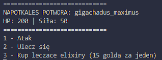

### Dungeon Explorer – Gra tekstowa w Rust

**Dungeon Explorer** to jakaś prosta gra przygodowa w **Rust**, gdzie włazisz do lochów, bijesz potwory, zbierasz skarby. Celem jest przeżycie jak najdłużej. Gra jest generowana losowo, więc nie ma nudy.

#### **Co robisz?**
1. Wchodzisz do pokoju – może być pusty, z potworem, albo skarbem.
2. Walczysz z potworami. Proste: atakujesz, oni atakują.
3. Zbierasz skarby, mikstury, artefakty.




#### **Co znajdziesz?**
- **Pokój**: Każdy jest inny, możesz znaleźć coś fajnego albo trafić na potwora.
- **Walka**: Potwory. Zabijasz je, albo nie.

#### **Struktura projektu**
- **`main.rs`** – główny plik, logika gry.
- **`Cargo.toml`** – Zależności, czyli `rand` do losowania.

#### **Instalacja**
1. Klonujesz repo:
   ```
   git clone https://github.com/TwójUsername/dungeon-explorer.git
   ```
2. Zainstaluj **Rust** (jeśli jeszcze tego nie zrobiłeś).
3. Uruchom:
   ```
   cd dungeon-explorer
   cargo run
   ```

#### **Co można dodać?**
- Więcej potworów, broni, skarbów – jak masz ochotę.
- Lepszy system walki – jeśli ci się nudzi.
